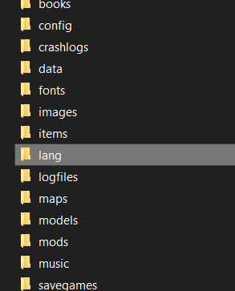
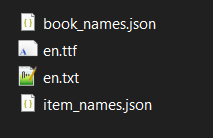
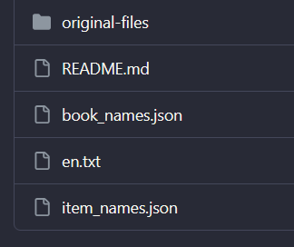

# Tradução PT-BR para o joguinho Barony

## Overview

Não encontrei uma tradução do joguinho então fiz eu mesmo, se divirtam.

Realizei essa tradução com assistência do IA github copilot. Fiz algumas decisões opiniadas ao decorrer do processo e consertei certos erros, mas não revisei tudo, então podem haver erros. Os erros que eu "consertei" poderiam passar batidos sem problemas, então não se preocupem.

O jogo usa uma fonte específica para seus textos, fonte esta que não possui acentos ou "ç". Isso significa que existirão palavras como "pocao" ao invés de "poção". Para corrigir isso seria necessário criar uma fonte, pegar uma de algum lugar ou editar a fonte que o jogo usa, adicionando esses caracteres. *\<[Saber mais](https://steamcommunity.com/sharedfiles/filedetails/?id=3041735536)\>*

## Guia

O jogo pega todos seus textos da pasta "lang" dentro da pasta do jogo.

Para aplicar a tradução basta copiar os arquivos "book_names.json", "en.txt" e "item_names.json"

e colar dentro da pasta "lang", substituindo o que tá lá.
